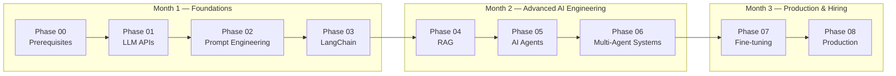

# AI Engineer Roadmap — From Zero to Production

A complete, hands-on path to becoming an AI Engineer: from never having opened
a terminal, to shipping a containerized, evaluated, observable AI product.
Nine phases, nine working projects, zero hand-waving.

Every phase ships two things: a full technical article (the theory, the
trade-offs, the "why") and a tested, working project (the "how"). Nothing in
this repo is pseudocode — every script here has actually been run.

---

## Table of Contents

- [What This Is](#what-this-is)
- [Who This Is For](#who-this-is-for)
- [The Curriculum](#the-curriculum)
- [Tech Stack Covered](#tech-stack-covered)
- [Repository Structure](#repository-structure)
- [How to Use This Repo](#how-to-use-this-repo)
- [Capstone Projects at a Glance](#capstone-projects-at-a-glance)
- [Bonus: AI System Design for Interviews](#bonus-ai-system-design-for-interviews)
- [Progress](#progress)
- [About](#about)

---

## What This Is

This repo is a self-contained curriculum for going from **complete beginner**
(or from "I know ML/DL theory but have never shipped an AI product") to
**hireable AI Engineer** — someone who can design, build, evaluate, and
deploy real LLM-powered systems, not just call an API in a notebook.



Each phase builds directly on the last. By Phase 08 you're not assembling
toy demos anymore — you're wrapping a RAG pipeline in a FastAPI backend with
authentication, rate limiting, Docker containers, automated RAGAS evaluation,
and Langfuse observability, the same shape as a real production AI service.

## Who This Is For

This curriculum has **two entry points**, depending on your background.

**Track A — You already know ML/DL/transformers and little bit of development, but haven't built AI
products.** Start at **Phase 01**. The roadmap assumes that theoretical
foundation and goes straight into APIs, prompting, RAG, agents,
fine-tuning, and production deployment.

**Track B — You're starting from zero.** No programming background, never
used an IDE, never deployed anything. Start at **Phase 0**. It's a fully
hand-held bridge covering dev environment setup, Python fundamentals,
HTTP/APIs, and a no-math AI primer — specifically scoped to unblock
everything Phase 01 onward assumes you already know.

```
Non-tech background?  ──► Phase 0 ──► Phase 01 ──► ... ──► Phase 08
Know ML/DL and Development already?   ───────────────► Phase 01 ──► ... ──► Phase 08
```

## The Curriculum

### Phase 00 — Foundations (prerequisite track)

| Part | Topic | Status |
|---|---|---|
| 1 | Dev environment & tools — terminal, Python install, virtual environments, VS Code, Git & GitHub | ✅ |
| 2 | Python fundamentals I — variables, data types, control flow, functions |
| 3 | Python fundamentals II — classes, error handling, file I/O, type hints, decorators |
| 4 | The command line, APIs & the web — HTTP, JSON, API keys, `.env` files, localhost/ports | ✅ |
| 5 | A gentle, no-math AI primer — ML, neural networks, LLMs, tokens, embeddings | ✅ |
| 6 | Capstone checkpoint — guided mini-project + full readiness checklist | ✅ |

### Phase 01 – 08 — The Core Roadmap

| Phase | Title | What You Build | Key Skills |
|---|---|---|---|
| 01 | LLM API Foundations | A universal client wrapping OpenAI, Claude & Gemini — streaming, retries, async, cost tracking | Provider SDKs, messages format, streaming, tokens, exponential backoff, async/parallel calls |
| 02 | Prompt Engineering | A structured data extraction pipeline (emails, job postings, articles → validated JSON) | Zero/few-shot, Chain-of-Thought, function calling, `instructor`, Jinja2 templating |
| 03 | LangChain & Orchestration | A multi-turn document chat system with session memory | LCEL chains, `RunnableWithMessageHistory`, document loaders, text splitting, LangSmith tracing |
| 04 | RAG & Vector Databases | A hybrid-retrieval RAG app with re-ranking, citations, and a Streamlit UI | Embeddings, ChromaDB, BM25 + vector hybrid search, cross-encoder re-ranking, HyDE, parent-child chunking |
| 05 | AI Agents & LangGraph | An autonomous research agent that searches, reads, and reports | ReAct pattern, tool calling, `StateGraph`, memory checkpointers, human-in-the-loop, loop detection |
| 06 | Multi-Agent Systems | A 6-agent content factory (research → write → edit → publish, 3 platforms in parallel) | CrewAI agents/tasks/crews, role specialization, sequential vs parallel orchestration |
| 07 | Fine-tuning & Customization | A QLoRA-fine-tuned domain-expert model, evaluated against its base | LoRA/QLoRA, Hugging Face `transformers`/`datasets`/`peft`/`trl`, Unsloth, LLM-as-judge evaluation |
| 08 | Production & Deployment | A containerized, observable AI service with automated quality gates | FastAPI, Docker/Compose, RAGAS evaluation, Langfuse observability, Streamlit frontend |

## Tech Stack Covered

| Category | Libraries |
|---|---|
| LLM provider SDKs | `openai`, `anthropic`, `google-generativeai` |
| Structured output & validation | `pydantic`, `instructor`, `jinja2` |
| Orchestration & agents | `langchain`, `langgraph`, `crewai` |
| RAG & vector search | `chromadb`, `sentence-transformers`, `rank-bm25`, `pypdf`, `beautifulsoup4` |
| Fine-tuning | `transformers`, `datasets`, `peft`, `trl`, `bitsandbytes`, `unsloth` |
| Production & evaluation | `fastapi`, `uvicorn`, `slowapi`, `streamlit`, `ragas`, `deepeval`, `langfuse`, `langsmith`, Docker |
| Cross-cutting | `tenacity`, `tiktoken`, `httpx`, `python-dotenv` |

## Repository Structure

```
ai-engineer-roadmap/
├── README.md                          ← this file
│
├── phase00-foundations/
│   ├── part1-dev-environment/
│   │   ├── README.md                  (the article)
│   │   ├── cheatsheet.md
│   │   └── check_setup.py
│   ├── part4-apis-and-the-web/
│   │   ├── README.md
│   │   ├── api_demo.py
│   │   ├── .env.example
│   │   └── advice_solution.py
│   ├── part5-ai-primer/
│   │   ├── README.md
│   │   └── embedding_toy.py
│   └── part6-capstone/
│       ├── README.md
│       └── advice_journal.py
│
├── phase01-llm-api-foundations/
│   ├── ARTICLE.md
│   ├── README.md                      (project-specific quick start)
│   ├── llm_client.py
│   ├── demo.py
│   └── requirements.txt
│
├── phase02-prompt-engineering/
│   ├── ARTICLE.md
│   ├── README.md
│   ├── extractor.py
│   ├── models.py
│   ├── demo.py
│   └── requirements.txt
│
├── phase03-langchain-orchestration/
│   ├── ARTICLE.md
│   ├── README.md
│   ├── doc_chat.py
│   ├── demo.py
│   └── requirements.txt
│
├── phase04-rag-vector-databases/
│   ├── ARTICLE.md
│   ├── README.md
│   ├── rag_engine.py
│   ├── app.py
│   ├── demo.py
│   └── requirements.txt
│
├── phase05-ai-agents-langgraph/
│   ├── ARTICLE.md
│   ├── README.md
│   ├── tools.py
│   ├── research_agent.py
│   ├── demo.py
│   └── requirements.txt
│
├── phase06-multi-agent-systems/
│   ├── ARTICLE.md
│   ├── README.md
│   ├── agents.py
│   ├── tasks.py
│   ├── tools.py
│   ├── content_factory.py
│   ├── demo.py
│   └── requirements.txt
│
├── phase07-fine-tuning-customization/
│   ├── ARTICLE.md
│   ├── README.md
│   ├── dataset_prep.py
│   ├── train.py
│   ├── evaluate.py
│   ├── inference_api.py
│   ├── demo_client.py
│   └── requirements.txt
│
├── phase08-production-deployment/
│   ├── ARTICLE.md
│   ├── README.md
│   ├── rag_service.py
│   ├── main.py
│   ├── observability.py
│   ├── evaluation.py
│   ├── streamlit_app.py
│   ├── demo_client.py
│   ├── Dockerfile
│   ├── Dockerfile.streamlit
│   ├── docker-compose.yml
│   ├── .env.example
│   └── requirements.txt
│
└── bonus-ai-system-design/
    ├── part1-framework-and-tradeoffs.md
    └── part2-architecture-patterns.md
```

## How to Use This Repo

```bash
# 1. Clone it
git clone https://github.com/yourusername/ai-engineer-roadmap.git
cd ai-engineer-roadmap

# 2. Pick your starting point
#    - No tech background?      → start in phase00-foundations/part1-dev-environment/
#    - Know ML/DL already?      → start in phase01-llm-api-foundations/

# 3. For any phase folder:
cd phase01-llm-api-foundations

#    a. Read ARTICLE.md first — the theory, trade-offs, and full explanations
#    b. Set up the environment
python -m venv venv
source venv/bin/activate        # Windows: venv\Scripts\activate
pip install -r requirements.txt
cp .env.example .env            # fill in your API keys

#    c. Run the demo
python demo.py
```

Each phase's `README.md` has phase-specific setup details (some phases need
extra steps — Phase 07 needs a GPU/Colab, Phase 08 has a Docker option).

## Capstone Projects at a Glance

| Phase | Project | Try it |
|---|---|---|
| 01 | Universal LLM Client | `python demo.py` — see all 3 providers, streaming, and cost tracking side by side |
| 02 | Structured Data Extractor | `python demo.py` — extract clean JSON from raw emails, job postings, articles |
| 03 | Doc Chat with Memory | `python demo.py` — multi-turn Q&A over any PDF/text/URL with persistent memory |
| 04 | RAG Document Q&A | `streamlit run app.py` — upload a PDF, ask questions, see cited sources |
| 05 | AI Research Agent | `python demo.py` — watch an agent search, read, and write a structured report |
| 06 | Multi-Agent Content Factory | `python demo.py` — one topic in, blog/LinkedIn/Twitter content out, in parallel |
| 07 | Domain Expert Fine-tune | Run in Colab — fine-tune Llama-3-8B, evaluate vs base model |
| 08 | Production AI Service | `docker-compose up` — a full containerized, observable AI backend + frontend |

## Bonus: AI System Design for Interviews

Beyond the build-it phases, this repo includes a system design series for
AI Engineer interviews specifically — the framework, trade-off vocabulary,
and worked examples that come up in design rounds:

- **Part 1 — Framework & Trade-off Vocabulary** *(available)*: the 7-step
  interview framework, 8 core trade-off dimensions, latency/cost
  back-of-envelope math
- **Part 2 — Architecture Pattern Library** *(available)*: the RAG
  architecture spectrum (naive → advanced → agentic), agent/multi-agent
  patterns, caching architecture, safety/guardrail layers, the monitoring
  stack, and a combined reference architecture
- Part 3 — Worked interview examples *(planned)*
- Part 4 — Rapid-fire trade-off Q&A *(planned)*

See `bonus-ai-system-design/`.

## Progress

```
[x] Phase 00 — Part 1: Dev Environment & Tools
[ ] Phase 00 — Part 2: Python Fundamentals I
[ ] Phase 00 — Part 3: Python Fundamentals II
[x] Phase 00 — Part 4: Command Line, APIs & the Web
[x] Phase 00 — Part 5: Gentle AI Primer
[x] Phase 00 — Part 6: Capstone Checkpoint
[x] Phase 01 — LLM API Foundations
[x] Phase 02 — Prompt Engineering
[x] Phase 03 — LangChain & Orchestration
[x] Phase 04 — RAG & Vector Databases
[x] Phase 05 — AI Agents & LangGraph
[x] Phase 06 — Multi-Agent Systems
[x] Phase 07 — Fine-tuning & Customization
[x] Phase 08 — Production & Deployment
```

## About

This roadmap was built progressively, phase by phase, combining ML/DL
fundamentals with hands-on AI engineering practice — every project here was
actually run and tested, not just written.

**Maintained by:** Kumar Shikhar
**Contact:** (https://www.linkedin.com/in/kumar-shikhar-ai/)

---

## License

This project is licensed under the MIT License — feel free to use this
curriculum structure for your own learning.
