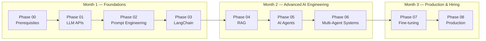

# AI Engineer Roadmap - From Zero to Production

A complete, hands-on path to becoming an AI Engineer: from never having opened
a terminal, to shipping a containerized, evaluated, observable AI product.
Nine phases, nine working projects, zero hand-waving.

Every phase ships two things: a full technical article (the theory, the
trade-offs, the "why") and a tested, working project (the "how"). Nothing in
this repo is pseudocode: every script here has actually been run.

---

## Table of Contents

- [What This Is](#what-this-is)
- [Who This Is For](#who-this-is-for)
- [The Curriculum](#the-curriculum)
- [Tech Stack Covered](#tech-stack-covered)
- [Repository Structure](#repository-structure)
- [How to Use This Repo](#how-to-use-this-repo)
- [Capstone Projects at a Glance](#capstone-projects-at-a-glance)
- [Practice Projects](#practice-projects)
- [Bonus: AI System Design for Interviews](#bonus-ai-system-design-for-interviews)
- [Progress](#progress)
- [About](#about)

---

## What This Is

This repo is a self-contained curriculum for going from **complete beginner**
(or from "I know ML/DL theory but have never shipped an AI product") to
**hireable AI Engineer**, someone who can design, build, evaluate, and
deploy real LLM-powered systems, not just call an API in a notebook.



Each phase builds directly on the last. By Phase 08 you're not assembling
toy demos anymore: you're wrapping a RAG pipeline in a FastAPI backend with
authentication, rate limiting, Docker containers, automated RAGAS evaluation,
and Langfuse observability, the same shape as a real production AI service.

## Who This Is For

This curriculum has **two entry points**, depending on your background.

**Track A, for readers who already know ML/DL/transformers and have some
development experience but haven't built AI products.** Start at
**Phase 01**. The roadmap assumes that theoretical foundation and goes
straight into APIs, prompting, RAG, agents, fine-tuning, and production
deployment.

**Track B, for readers starting from zero.** No programming background,
never used an IDE, never deployed anything. Start at **Phase 0**. It's a
fully hand-held bridge covering dev environment setup, Python fundamentals,
HTTP/APIs, and a no-math AI primer, specifically scoped to unblock
everything Phase 01 onward assumes you already know.

```
Non-tech background?  ──► Phase 0 ──► Phase 01 ──► ... ──► Phase 08
Know ML/DL and Development already?   ───────────────► Phase 01 ──► ... ──► Phase 08
```

## The Curriculum

### Phase 0 - Foundations (prerequisite track)

| Part | Topic | Status |
|---|---|---|
| 1 | Dev environment & tools - terminal, Python install, virtual environments, VS Code, Git & GitHub | ✅ |
| 2 | Python fundamentals I - variables, data types, control flow, functions | ✅ |
| 3 | Python fundamentals II - classes, dataclasses, error handling, file I/O, type hints, decorators, context managers, generators, async/await | ✅ |
| 4 | The command line, APIs & the web - HTTP, JSON, API keys, `.env` files, localhost/ports | ✅ |
| 5 | A gentle, no-math AI primer - ML, neural networks, LLMs, tokens, embeddings | ✅ |
| 6 | Capstone checkpoint - guided mini-project + full readiness checklist | ✅ |

### Phase 01 – 08 - The Core Roadmap

| Phase | Title | What You Build | Key Skills |
|---|---|---|---|
| 01 | LLM API Foundations | A universal client wrapping OpenAI, Claude & Gemini — streaming, retries, async, cost tracking | Provider SDKs, messages format, streaming, tokens, exponential backoff, async/parallel calls |
| 02 | Prompt Engineering | A structured data extraction pipeline (emails, job postings, articles → validated JSON) | Zero/few-shot, Chain-of-Thought, function calling, `instructor`, Jinja2 templating |
| 03 | LangChain & Orchestration | A multi-turn document chat system with session memory | LCEL chains, `RunnableWithMessageHistory`, document loaders, text splitting, LangSmith tracing |
| 04 | RAG & Vector Databases | A hybrid-retrieval RAG app with re-ranking, citations, and a Streamlit UI | Embeddings, ChromaDB, BM25 + vector hybrid search, cross-encoder re-ranking, HyDE, parent-child chunking |
| 05 | AI Agents & LangGraph | An autonomous research agent that searches, reads, and reports | ReAct pattern, tool calling, `StateGraph`, memory checkpointers, human-in-the-loop, loop detection |
| 06 | Multi-Agent Systems | A 6-agent content factory (research → write → edit → publish, 3 platforms in parallel) | CrewAI agents/tasks/crews, role specialization, sequential vs parallel orchestration |
| 07 | Fine-tuning & Customization | A QLoRA-fine-tuned domain-expert model, evaluated against its base | LoRA/QLoRA, Hugging Face `transformers`/`datasets`/`peft`/`trl`, Unsloth, LLM-as-judge evaluation |
| 08 | Production & Deployment | A containerized, observable AI service with automated quality gates | FastAPI, Docker/Compose, RAGAS evaluation, Langfuse observability, Streamlit frontend |

## Tech Stack Covered

| Category | Libraries |
|---|---|
| LLM provider SDKs | `openai`, `anthropic`, `google-generativeai` |
| Structured output & validation | `pydantic`, `instructor`, `jinja2` |
| Orchestration & agents | `langchain`, `langchain-community`, `langchain-experimental`, `langgraph`, `langgraph-checkpoint-sqlite`, `crewai`, `crewai-tools` |
| RAG & vector search | `chromadb`, `sentence-transformers`, `rank-bm25`, `pypdf`, `beautifulsoup4` |
| Web search & agent tools | `tavily-python`, `numexpr` |
| Fine-tuning (GPU/Colab only) | `unsloth`, `torch`, `transformers`, `datasets`, `trl`, `peft`, `accelerate`, `bitsandbytes`, `huggingface_hub` |
| Production & evaluation | `fastapi`, `uvicorn`, `slowapi`, `python-multipart`, `streamlit`, `ragas`, `langfuse`, `langsmith`, Docker |
| Cross-cutting | `tenacity`, `tiktoken`, `httpx`, `python-dotenv`, `numpy` |

## Repository Structure

Folders are named `Phase_N <Title>` (with spaces) on disk. Each phase pairs a
topic-named article (the theory) with a small, runnable project (the
practice); there is no separate `ARTICLE.md`, the article *is* the
topic-named `.md` file.

```
AI-Engineering-Bootcamp/
├── README.md                          ← this file
│
├── Phase_0 Prerequisites/
│   ├── README.md                      ← index of all 6 parts
│   ├── Part-1 Dev Environment/
│   │   ├── dev_environment_and_tools.md
│   │   ├── cheatsheet.md
│   │   └── check_setup.py
│   ├── Part-2 & 3 Python Fundamentals/
│   │   ├── Python_fundamentals.md     ← in-repo article, scoped to this repo's own patterns
│   │   └── fundamentals_demo.py       ← runnable companion script, stdlib only
│   ├── Part-4 Command Line and APIs/
│   │   ├── Command_line_APIs_the_Web.md
│   │   ├── api_demo.py
│   │   ├── advice_solution.py
│   │   └── .env.example
│   ├── Part-5 No-Math AI Basics/
│   │   ├── AI_Primer.md
│   │   └── Embedding_example.py
│   └── Part-6 Final Checkpoint/
│       ├── Checkpoint.md
│       └── advice_journal.py
│
├── Phase_1 LLM APIs/
│   ├── llm_api_foundations.md
│   ├── README.md                      (project-specific quick start)
│   ├── llm_client.py
│   ├── demo.py
│   ├── requirements.txt
│   └── .env.example
│
├── Phase_2 Prompt Engineering/
│   ├── prompt_engineering.md
│   ├── README.md
│   ├── extractor.py
│   ├── models.py
│   ├── demo.py
│   ├── requirements.txt
│   └── .env.example
│
├── Phase_3 Langchain Orchestration/
│   ├── langchain_orchestration.md
│   ├── README.md
│   ├── doc_chat.py
│   ├── demo.py
│   ├── requirements.txt
│   └── .env.example
│
├── Phase_4 RAG & Vector Databases/
│   ├── rag_vector_databases.md
│   ├── README.md
│   ├── rag_engine.py
│   ├── app.py
│   ├── demo.py
│   ├── requirements.txt
│   └── .env.example
│
├── Phase_5 AI Agents & LangGraph/
│   ├── ai_agents_langgraph.md
│   ├── README.md
│   ├── tools.py
│   ├── research_agent.py
│   ├── demo.py
│   ├── requirements.txt
│   └── .env.example
│
├── Phase_6 Multi-Agent Systems/
│   ├── multi_agent_systems.md
│   ├── README.md
│   ├── agents.py
│   ├── tasks.py
│   ├── tools.py
│   ├── content_factory.py
│   ├── demo.py
│   ├── requirements.txt
│   └── .env.example
│
├── Phase_7 Fine-Tuning & Customization/
│   ├── fine_tuning_customization.md
│   ├── README.md
│   ├── dataset_prep.py
│   ├── train.py
│   ├── evaluate.py
│   ├── inference_api.py
│   ├── demo_client.py
│   ├── requirements.txt
│   └── .env.example
│
├── Phase_8 Production & Deployment/
│   ├── production_deployment.md
│   ├── README.md
│   ├── rag_service.py
│   ├── main.py
│   ├── observability.py
│   ├── evaluation.py
│   ├── streamlit_app.py
│   ├── demo_client.py
│   ├── Dockerfile
│   ├── Dockerfile.streamlit
│   ├── docker-compose.yml
│   ├── requirements.txt
│   └── .env.example
│
├── Project_1 Smart Inbox Triage/
│   ├── README.md
│   ├── triage.py                      ← imports Phase 1 + 2 code directly
│   ├── demo.py
│   ├── requirements.txt
│   └── .env.example
│
├── Project_2 Research Copilot/
│   ├── README.md
│   ├── copilot_graph.py               ← imports Phase 3 + 4 + 5 code directly
│   ├── demo.py
│   ├── requirements.txt
│   └── .env.example
│
├── Project_3 Autonomous Content Desk/
│   ├── README.md
│   ├── crew.py                        ← imports Phase 6 code, calls Phase 7 over HTTP
│   ├── main.py
│   ├── evaluation.py
│   ├── Dockerfile
│   ├── docker-compose.yml
│   ├── requirements.txt
│   └── .env.example
│
├── Project_4 Recipe & Meal Planner/
│   ├── README.md
│   ├── meal_planner.py                ← imports Phase 2 + 4 code directly
│   ├── demo.py
│   ├── requirements.txt
│   ├── .env.example
│   └── sample_recipes/
│
├── Project_5 Travel Itinerary Planner/
│   ├── README.md
│   ├── itinerary_planner.py           ← imports Phase 2 + 5 code directly
│   ├── demo.py
│   ├── requirements.txt
│   └── .env.example
│
└── Bonus AI System Design/
    ├── framework_and_tradeoffs.md
    └── architecture_patterns.md
```

## How to Use This Repo

```bash
# 1. Clone it
git clone https://github.com/shikharkumar13/AI-Engineering-Bootcamp.git
cd AI-Engineering-Bootcamp

# 2. Pick your starting point
#    - No tech background?      → start in "Phase_0 Prerequisites/"
#    - Know ML/DL already?      → start in "Phase_1 LLM APIs/"

# 3. For any phase folder:
cd "Phase_1 LLM APIs"

#    a. Read the topic-named .md article first — the theory, trade-offs,
#       and full explanations (e.g. llm_api_foundations.md)
#    b. Set up the environment
python -m venv venv
source venv/bin/activate        # Windows: venv\Scripts\activate
pip install -r requirements.txt
cp .env.example .env            # fill in your API keys

#    c. Run the demo
python demo.py
```

Each phase's own `README.md` has the exact filenames and any phase-specific
setup steps (Phase 07 needs a GPU/Colab, Phase 08 has a Docker option); it's
the authoritative quick-start for that phase, more so than this table.

## Capstone Projects at a Glance

| Phase | Project | Try it |
|---|---|---|
| 01 | Universal LLM Client | `python demo.py` - see all 3 providers, streaming, and cost tracking side by side |
| 02 | Structured Data Extractor | `python demo.py` - extract clean JSON from raw emails, job postings, articles |
| 03 | Doc Chat with Memory | `python demo.py` - multi-turn Q&A over any PDF/text/URL with persistent memory |
| 04 | RAG Document Q&A | `streamlit run app.py` - upload a PDF, ask questions, see cited sources |
| 05 | AI Research Agent | `python demo.py` - watch an agent search, read, and write a structured report |
| 06 | Multi-Agent Content Factory | `python demo.py` - one topic in, blog/LinkedIn/Twitter content out, in parallel |
| 07 | Domain Expert Fine-tune | Run in Colab - fine-tune Llama-3-8B, evaluate vs base model |
| 08 | Production AI Service | `docker-compose up` - a full containerized, observable AI backend + frontend |

## Practice Projects

The phases above are practiced one at a time. These five combine adjacent
phases into a single project each, so you get real end-to-end reps chaining
skills together, the way a real feature actually needs them. Each imports
the relevant phase's code directly rather than duplicating it.

| Project | Combines | What it builds | Try it |
|---|---|---|---|
| [`Project_1 Smart Inbox Triage`](Project_1%20Smart%20Inbox%20Triage/README.md) | Phase 1 + 2 | Extracts structured fields from support tickets, then drafts a reply with multi-provider fallback and cost tracking | `python demo.py` |
| [`Project_2 Research Copilot`](Project_2%20Research%20Copilot/README.md) | Phase 3 + 4 + 5 | Multi-turn chat over your own documents that falls back to live web research when local retrieval isn't confident | `python demo.py` |
| [`Project_3 Autonomous Content Desk`](Project_3%20Autonomous%20Content%20Desk/README.md) | Phase 6 + 7 + 8 | A FastAPI service fronting the multi-agent content crew, plus a fine-tune-vs-general-agent comparison endpoint, with a content-quality evaluation gate | `docker-compose up --build` |
| [`Project_4 Recipe & Meal Planner`](Project_4%20Recipe%20%26%20Meal%20Planner/README.md) | Phase 2 + 4 | Cited Q&A over your own recipes, matches what you can cook against ingredients you already have, and merges a shopping list across chosen recipes | `python demo.py` |
| [`Project_5 Travel Itinerary Planner`](Project_5%20Travel%20Itinerary%20Planner/README.md) | Phase 2 + 5 | Live-researches a destination via a ReAct agent, then structures the findings into a day-by-day itinerary with practical tips and sources | `python demo.py` |

## Bonus: AI System Design for Interviews

Beyond the build-it phases, this repo includes a system design series for
AI Engineer interviews specifically: the framework, trade-off vocabulary,
and worked examples that come up in design rounds.

- **Part 1 - Framework & Trade-off Vocabulary** *(available)*: the 7-step
  interview framework, 8 core trade-off dimensions, latency/cost
  back-of-envelope math. See [`framework_and_tradeoffs.md`](Bonus%20AI%20System%20Design/framework_and_tradeoffs.md)
- **Part 2 - Architecture Pattern Library** *(available)*: the RAG
  architecture spectrum (naive → advanced → agentic), agent/multi-agent
  patterns, caching architecture, safety/guardrail layers, the monitoring
  stack, and a combined reference architecture. See [`architecture_patterns.md`](Bonus%20AI%20System%20Design/architecture_patterns.md)
- Part 3 - Worked interview examples *(planned)*
- Part 4 - Rapid-fire trade-off Q&A *(planned)*

See `Bonus AI System Design/`.

## Progress

```
[x] Phase 0 - Part 1: Dev Environment & Tools
[x] Phase 0 - Part 2: Python Fundamentals I
[x] Phase 0 - Part 3: Python Fundamentals II
[x] Phase 0 - Part 4: Command Line, APIs & the Web
[x] Phase 0 - Part 5: Gentle AI Primer
[x] Phase 0 - Part 6: Capstone Checkpoint
[x] Phase 01 - LLM API Foundations
[x] Phase 02 - Prompt Engineering
[x] Phase 03 - LangChain & Orchestration
[x] Phase 04 - RAG & Vector Databases
[x] Phase 05 - AI Agents & LangGraph
[x] Phase 06 - Multi-Agent Systems
[x] Phase 07 - Fine-tuning & Customization
[x] Phase 08 - Production & Deployment
[x] Project 1 - Smart Inbox Triage
[x] Project 2 - Research Copilot
[x] Project 3 - Autonomous Content Desk
[x] Project 4 - Recipe & Meal Planner
[x] Project 5 - Travel Itinerary Planner
[x] Bonus - AI System Design (Parts 1-2)
```

## About

This roadmap was built progressively, phase by phase, combining ML/DL
fundamentals with hands-on AI engineering practice. Every project here was
actually run and tested, not just written.

**Maintained by:** Kumar Shikhar
**Contact:** (https://www.linkedin.com/in/kumar-shikhar-ai/)

---

## License

This project is licensed under the MIT License. Feel free to use this
curriculum structure for your own learning.
